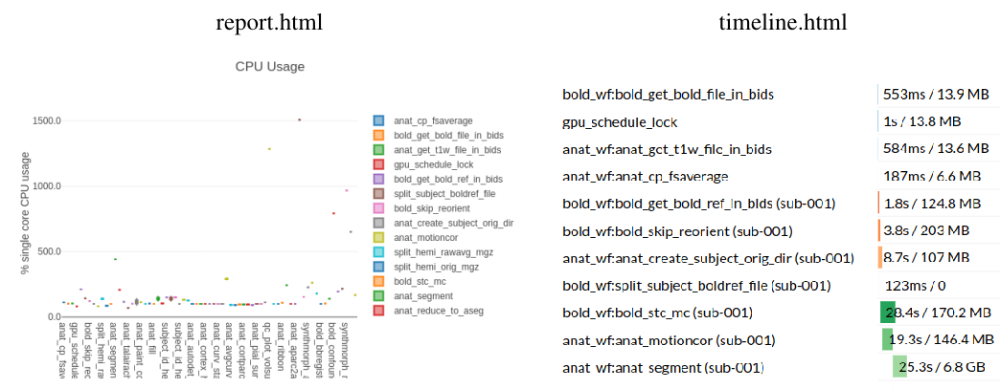
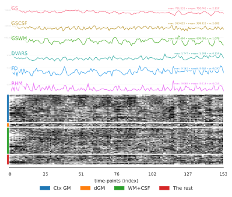

---------------------
Outputs of *DeepPrep*
---------------------

DeepPrep outputs conform to the BIDS Derivatives specification. DeepPrep generates
three broad classes of outcomes:
  1. **Anatomical derivatives**:Anatomical information about brain structures and generate surface models and parcellation labels.For example, skull stripping、gray/white matter segmentation、surface generation、parcellation and labeling..
  2. **Functional derivatives**:Contains some results of some BOLD data preprocessing operations.For example, motion correction、spatial normalization、slice timing correction..
  3. **Visual QA (quality assessment) reports**:one HTML per subject, that allows the user a thorough visual assessment of the quality of processing and ensures the transparency of DeepPrep operation.

======================
Anatomical derivatives
======================

If Anatomical is run, then a FreeSurfer subjects directory is created in ``<output dir>/Recon/``: ::

 <output_dir>/
   Recon/
     fsaverage/
     sub-<subject_label>/
     sub-<subject_label>/
       label/
       mri/
       scripts/
       ...
     ...

The preprocessed structural MRI data are organized to align with the results of FreeSurfer, encompassing the normalized and skull-stripped brain, reconstructed cortical surfaces and morphometrics, volumetric segmentation, cortical surface parcellation, and their corresponding statistics. Additionally, transformation files for surface spherical registration are included.

======================
Functional derivatives
======================

For the preprocessed functional MRI data, the naming adheres to the **BIDS** specification for derived data.Functional derivatives are stored in the ``<output dir>/BOLD/`` . All derivatives contain ``task-<task_label>`` (mandatory) and ``run-<run_index>`` (optional), and these will be indicated with ``[specifiers]``: ::

 <output_dir>/
   BOLD/
     sub-<subject_label>/
     sub-<subject_label>/
       anat/
         sub-<subject_label>_space-MNI152NLin6Asym_res-02_desc-noskull_T1w.nii.gz
         sub-<subject_label>_space-T1w_res-2mm_desc-noskull_T1w.nii.gz
          ...
       figures/
         sub-<subject_label>_[specifiers]_desc-summary_bold.html
         ...
       func/
         sub-<subject_label>_from-T1w_to-MNI152NLin6Asym_desc-affine_xfm.txt
         sub-<subject_label>_[specifiers]_space-MNI152NLin6Asym_res-02_desc-preproc_bold.nii.gz
     ...
     dataset_description.json

For the preprocessed functional MRI data, the naming adheres to the BIDS specification for derived data. The default output spaces for the preprocessed functional MRI consist of three options: 1. the native BOLD fMRI space, 2. the MNI space, and 3. the fsaverage6 surfaces space. However, users have the flexibility to specify other output spaces, including the native T1w space and various volumetric and surface templates available on TemplateFlow. The main outputs of the preprocessed data include:

 | 1.Preprocessed fMRI data.
 | 2.Reference volume for motion correction.
 | 3.Brain masks in the BOLD native space, include the nuisance masks, such as the ventricle and white-matter masks.
 | 4.Transformation files for between T1w and the fMRI reference and between T1w and the standard templates.
 | 5.Head motion parameters and the temporal SNR map.
 | 6.Confound matrix.

Functional derivatives are stored in the ``func/`` subfolder: ::

 sub-<subject_label>/
  func/
   sub-<subject_label>_[specifiers]_space-MNI152NLin6Asym_res-02_desc-preproc_bold.nii.gz

Corresponding to their reference frames: ::

 sub-<subject_label>/
  func/
   sub-<subject_label>_[specifiers]_space-MNI152NLin6Asym_res-02_desc-preproc_boldref.nii.gz

Additionally, the following transforms are saved: ::

 sub-<subject_label>/
  func/
   sub-<subject_label>_[specifiers]_from-orig_to-boldref_mode-image_desc-hmc_xfm.txt

Regularly gridded outputs (images). Volumetric output spaces labels(``<space_label>``) include T1w and MNI152NLin6Asym (default),with skull and without skull: ::

 sub-<subject_label>/
  anat/
   sub-<subject_label>_<space_label>-noskull_T1w.nii.gz
   sub-<subject_label>_<space_label>-skull_T1w.nii.gz

Extracted confounding time series. For each BOLD run processed with fMRIPrep, an accompanying confounds file will be generated. Confounds are saved as a TXT file: ::

 sub-<subject_label>/
  func/
   sub-<subject_label>_[specifiers]_desc-confounds_timeseries.txt

These TXT tables look like the example below, where each row of the file corresponds to one time point found in the corresponding BOLD time series: ::

 Frame dL dP dS pitch yaw roll dL_d dP_d dS_d pitch_d yaw_d roll_d WB WB_d vent vent_d wm wm_d comp1 comp2 comp3 comp4 comp5 comp6 comp7 comp8 comp9 comp10
 0.0 -0.167957 -0.005804 -0.025891 -0.02563 -0.071595 -0.064863 -0.003795 0.001174 -0.000564 -0.000137 -0.002249 0.0 761.5348 0.0 578.1313 0.0 641.49 0.0 432.7572 2401.9352 -299.8651 -1671.2518 -1253.1009 397.8136 163.2826 -41.0797 472.2521 -807.1487
 1.0 -0.13404 0.000822 -0.007671 -0.036357 -0.077003 -0.066058 0.029355 0.006758 0.017843 -0.012235 -0.00822 -0.0004 755.9881 -5.5467 562.3564 -15.7749 640.0309 -1.4591 116.3656 1856.4783 -215.4701 -1779.6254 -960.2177 -145.4347 -213.7004 143.5133 394.0687 -298.118
 2.0 -0.129323 0.002949 -0.032951 -0.036584 -0.071111 -0.073452 0.000205 0.002243 -0.025649 -0.001733 0.00311 -0.0066 755.3988 -0.5893 557.8778 -4.4786 641.3455 1.3146 -189.7777 1382.4168 -323.6598 -2114.3275 -686.64 -542.1671 83.6768 41.2142 332.3702 -393.3098
 3.0 -0.068406 -0.009025 -0.02573 -0.039511 -0.058919 -0.046847 0.056455 -0.011873 0.006858 -0.004432 0.009439 0.0274 753.7935 -1.6053 556.8582 -1.0195 640.1779 -1.1676 960.9202 3567.0036 611.4143 -197.2033 272.6215 -788.7565 661.9491 143.1371 550.578 54.312

==============
Visual Reports
==============

DeepPrep outputs summary reports, written to ``<output dir>/QC/``. These reports provide a quick way to make visual inspection of the results easy. ::

 <output_dir>/
   QC/
     sub-<subject_label>/
     sub-<subject_label>/
       figures/
       logs/
       sub-<subject_label>.html
     ...
     dataset_description.json
     nextflow.run.command
     nextflow.run.config
     report.html
     timeline.html

DeepPrep automatically generates a descriptive HTML report for each participant and session. `View a sample report <_static/sub-001.html>`_. The report commences with a concise summary of key imaging parameters extracted from the BIDS meta information. Subsequently, the report provides an overview of the overall CPU and GPU processing times for the data preprocessing. Key processing steps and results for structural images are visually presented, including segmentation, parcellation, spatial normalization, and coregistration. The normalization and coregistration outcomes are demonstrated through dynamic ‘before’ versus ‘after’ animations. Additionally, the report includes a carpet plot, showcasing both the raw and preprocessed fMRI data, along with a temporal signal-to-noise ratio (tSNR) map. Finally, the report concludes with comprehensive boilerplate methods text, offering a clear and consistent description of all preprocessing steps employed, accompanied by appropriate citations. Some examples are as follows:

|
The visual reports provide several sections per task and run to aid designing a denoising strategy for subsequent analysis. Some of the estimated confounds are plotted with a "carpet" visualization of the BOLD time series. An example of these plots follows:

The picture was ploted by the FMRISunmmary from the nipype and these values were calculated by the following methods.\n Global signals (GS) were calculated within the whole-brain, and the white-matter (GSWM) and the cerebro-spinal fluid (GSCSF) were calculated with their corresponding masks. The standardized DVARS was calculated by ComputeDVARS from the nipype. The framewise-displacement measures (FD) were calculated by FramewiseDisplacement from the nipype. The relative head motion (RHM) was calculated in this pipeline. \n A carpet plot shows the time series for all voxels within the brain mask. Cortical gray matter (Ctx GM), subcortical gray matter (dGM), white matter and CSF (WM+CSF), and the rest of brain (The rest) were devided into four groups.
