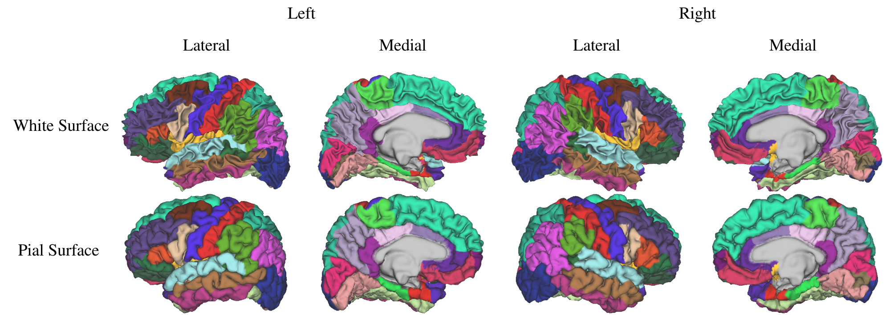

---------------------------
Processing pipeline details
---------------------------

DeepPrep adapts its pipeline depending on what data and metadata are available and are used as the input.

===============================
Preprocessing of structural MRI
===============================

The anatomical preprocessing workflow in DeepPrep closely follows the FreeSurfer pipeline while efficiently replacing several of the most time-consuming steps with deep learning algorithms. Specifically, the volumetric anatomical segmentation, cortical surface reconstruction, and cortical surface registration are accomplished using FastSurferCNN, FastCSR, SUGAR, respectively. The remaining steps in the workflow remain consistent with FreeSurfer v7.2, including the surface spherization, morphometric estimation, and statistics. These steps ensure the continued reliability and accuracy of the overall preprocessing process while harnessing the benefits of deep learning algorithms to enhance computational efficiency. The preprocessing workflow consists of several essential steps as follows:

**Motion correction.** If multiple T1w images are available for each participant or each session, FreeSurfer’s ``recon-all -motioncor`` is employed to correct head motions across the scans. This process yields an average T1w image to minimize the impact of head motions on data quality.

**Segmentations.** The whole brain is segmented into 95 cortical and subcortical regions using FastSurferCNN. Specifically, the segmentation model utilized is FastSurferCNN, which is optimized for accurate and rapid anatomical segmentations.

|

**Skull-stripping and bias field correction.** A brain mask is generated according the 95 whole-brain regions to achieve accurate and robust skull-stripping. The T1w images undergo N4 bias field correction using SimpleITK with reference to a brain mask. The brain mask can be generated automatically and also be manually edited in this process. Afterward, the normalized and skull-stripped T1w images could be fed into the subsequent steps.

.. raw:: html

   

    <object type="image/svg+xml" data="_static/rawavg_brainmask_combined.svg"></object>
   

|

**Cortical surface reconstruction.** The white-matter and pial cortical surfaces are reconstructed based on the anatomical segmentation derived from the FastSurferCNN. This process utilizes FastCSR, a deep-learning-based model designed to accelerate cortical surface reconstruction. FastCSR leverages an implicit representation of the cortical surface through the level-set representation, and uses a topology-preserving surface extraction method to yield white and pial surfaces represented by triangulated meshes. The reconstructed surface is inflated to a sphere with minimal distortion using the FreeSurfer command ``mris_sphere``.

|

**Cortical surface registration.**
The reconstructed surface is inflated to a sphere with minimal distortion using the FreeSurfer command mris_sphere. Both rigid and non-rigid registrations for the spherical cortical surface are performed to align anatomical landmarks and morphometrics, facilitated by the deep-learning registration framework SUGAR. Individual spherical surfaces are aligned to the fsaverage template surfaces by default.

**Cortical surface parcellation.**
The cortical surface parcellation is generated based on the cortical surface registration using the FreeSurfer command ``recon-all -cortparc``. Subsequently, the cortical parcellation is projected to the volumetric segmentation by assigning voxels their closest cortical labels via the command ``mri_surf2volseg``, thereby replacing the cortical parcellation derived from FastSurferCNN.
The parcellations were created based on the registration result generated from SUGAR, which aligns participants' surfaces with fsavreage template surfaces:

|

==================
BOLD preprocessing
==================

The functional preprocessing workflow in DeepPrep incorporates advanced registration methods, SynthMorph, to replace the most time-consuming step, the spatial normalization. The workflow is also complemented by existing tools, including AFNI or FSL, to form a comprehensive functional image preprocessing method. The fMRI preprocessing workflow consists of several essential steps as follows:

**Motion correction and slice-timing correction.**
The head motion parameters of the BOLD fMRI signals are estimated by MCFLIRT from FSL, with the middle frame selected as a reference volume for each run by default. Slice-timing correction is included in our processing pipeline for fMRI data using 3dTshift from AFNI, when slice-timing information is available in the BIDS metadata. This is an optional step and can be deactivated if the BIDS metadata does not specify slice times.

**Susceptibility distortion correction.**
DeepPrep incorporates SDCFlows (Susceptibility Distortion Correction Workflows) to correct susceptibility distortions. SDCFlows offers versatile workflows designed to preprocess various MRI schemes, enabling the estimation of B0 field-inhomogeneity maps directly associated with distortion. This distortion correction is applied to the fMRI data when the appropriate fieldmap information is available within the BIDS metadata. Distortion correction is an optional step.

**Coregistration.**
A rigid registration is performed using FreeSurfer’s boundary-based registration to align motion-corrected fMRI volumes to native T1w images for each subject. The registration optimizes the boundary-based loss function to align the boundary between gray and white matter across different imaging modalities.

.. raw:: html

   

       <object type="image/svg+xml" data="_static/sub-001_ses-01_task-rest_desc-reg2native_bold.svg"></object>
   

**Spatial normalization.**
The spatial normalization step aims to normalize individual brain images to a standard template, such as the MNI152NLin6Asym volumetric template and FreeSurfer’s fsaverage6 surface template. Traditionally, this step is highly time-consuming due to the requirement of non-rigid surface and volumetric registration, often taking hours for computations. However, in DeepPrep, a deep-learning algorithm called SynthMorph is utilized to achieve both rigid and non-rigid volumetric registration in minutes. Additionally, for both rigid and non-rigid cortical surface registration, the deep-learning cortical surface registration framework, SUGAR, is used to achieve accurate alignment in anantomical landmakrs and morphometrics in seconds. Subsequently, preprocessed BOLD fMRI volumes are projected to the MNI152NLin6Asym template and fsaverage6 template surfaces by default, through applying deformation matrices derived from the registrations. The pipeline also flexibly supports normalization to other volumetric human brain templates managed by the TemplateFlow.

.. raw:: html

 

  <object type="image/svg+xml" data="_static/sub-001_ses-01_task-rest_desc-reg2MNI152_bold.svg"></object>
 

==========
In summary
==========
This preprocessing workflow utilizes a combination of conventional methods and advanced deep learning algorithms to efficiently and accurately preprocess structural and functional images for neuroimaging analysis.

