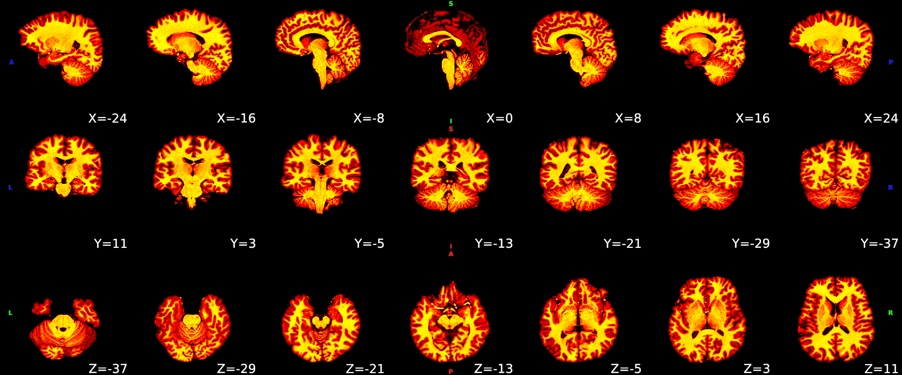

---------------------------
Processing pipeline details
---------------------------

DeepPrep adapts its pipeline depending on what data and metadata are available and are used as the input.

===============================
Preprocessing of structural MRI
===============================

The anatomical preprocessing workflow in DeepPrep closely follows the FreeSurfer pipeline while efficiently replacing several of the most time-consuming steps with deep learning algorithms. Specifically, the volumetric anatomical segmentation, cortical surface reconstruction, and cortical surface registration are accomplished using FastSurferCNN, FastCSR, SUGAR, respectively. The remaining steps in the workflow remain consistent with FreeSurfer v7.2, including the surface spherization, morphometric estimation, and statistics. These steps ensure the continued reliability and accuracy of the overall preprocessing process while harnessing the benefits of deep learning algorithms to enhance computational efficiency. The preprocessing workflow consists of several essential steps as follows:

**Motion correction**. If multiple T1w images are available for each participant or each session, FreeSurfer's "recon-all -motioncor" is employed to correct head motions across the scans. This process yields an average T1w image to minimize the impact of head motions on data quality.

展示图

**Skull-stripping and bias field correction**. A brain mask is generated according the 95 whole-brain regions to achieve accurate and robust skull-stripping. The T1w images undergo N4 bias field correction using SimpleITK with reference to a brain mask. The brain mask can be generated automatically and also be manually edited in this process. Afterward, the normalized and skull-stripped T1w images could be fed into the subsequent steps.
Results of the brain extraction and the segmentation of the T1w image, which shows the brain tissue segmentation and brain cortical surface structural parcellations：

|

**Segmentations**. The whole brain is segmented into 95 cortical and subcortical regions using FastSurferCNN. Specifically, the segmentation model utilized is FastSurferCNN, which is optimized for accurate and rapid anatomical segmentations.

|

**Cortical surface reconstruction**. The cortical surface is reconstructed based on the white matter segmented by FastSurferCNN. This process utilizes FastCSR, a deep-learning-based model designed to accelerate cortical surface reconstruction. FastCSR leverages an implicit representation of the cortical surface through the level-set representation, and uses a topology-preserving surface extraction method to yield white and pial surfaces represented by triangulated meshes. The reconstructed surface is inflated to a sphere with minimal distortion using the FreeSurfer command ``mris_sphere``.
Surfaces (white and pial) were reconstructed with FastCSR overlaied on the T1w space:

|

**Cortical surface parcellation**. The cortical surface parcellation is generated based on the cortical surface registration using the FreeSurfer command ``recon-all -cortparc``. Subsequently, the cortical parcellation is projected to the volumetric segmentation by assigning voxels their closest cortical labels via the command ``mri_surf2volseg``, thereby replacing the cortical parcellation derived from FastSurferCNN.
The parcellations were created based on the registration result generated from SUGAR, which aligns participants' surfaces with fsavreage template surfaces:

.. image:: _static/figures/sub-001_desc-surfparc_T1w.svg
   :width: 750
   :height: 350
   :alt: Alternative Text
   :align: center

|

==================
BOLD preprocessing
==================

The functional preprocessing workflow in DeepPrep incorporates advanced registration methods, SynthMorph, to replace the most time-consuming step, the spatial normalization. The workflow is also complemented by existing tools, including AFNI or FSL, to form a comprehensive functional image preprocessing method. The fMRI preprocessing workflow consists of several essential steps as follows:

**Dummy scan skipping and reorientation**. The fMRI preprocessing begins by skipping the first n-frames dummy scan (``mri_convert -nskip``), with n set to 0 by default. To ensure consistent image orientation, reorientation is performed if the input image is not in the RAS orientation. ::

     if nskip_frame > 0:
        sh.mri_convert('-i', bold, '--nskip', nskip_frame, '-o', skip_bold, _out=sys.stdout)
     else:
        skip_bold = bold

**Motion correction and slice-timing correction**. The head motion parameters of the BOLD fMRI signals are estimated by FSL's MCFLIRT, with the middle frame selected as a reference volume for each run by default. Slice-timing correction is included in our processing pipeline for fMRI data using AFNI's 3dTshift, when slice-timing information is available in the BIDS metadata. This is an optional step and can be deactivated if the BIDS metadata does not specify slice times.

展示一些图

**Coregistration**. A rigid registration is performed using FreeSurfer's boundary-based registration to align motion-corrected fMRI volumes to native T1w images for each subject. The registration optimizes the boundary-based loss function to align the boundary between gray and white matter across different imaging modalities.
Alignment of function and anatomical MRI data.bbregister was used to generate transormations from EPI-space to T1w-space:

.. raw:: html

   

       <object type="image/svg+xml" data="_static/figures/sub-001_ses-01_task-rest_desc-reg2native_bold.svg" style="width: 700px; height: 350px;"></object>
   

**Distortion correction**. Distortion correction is performed using SDCFlows (Susceptibility Distortion Correction Workflows). SDCFlows offers versatile workflows designed to preprocess various MRI schemes, enabling the estimation of B0 field-inhomogeneity maps directly associated with distortion. This correction is applied to the fMRI data when the appropriate fieldmap information is available within the BIDS metadata. Additionally, SDCFlows includes an experimental fieldmap-less distortion correction approach, which relies on a nonlinear registration process between the BOLD fMRI reference image and the T1w image. Distortion correction is an optional step.

展示一些图

**Spatial normalization**. The spatial normalization step aims to normalize individual brain images to a standard template, such as the MNI152 template and FreeSurfer's fsaverage6 surface template. The pipeline also flexibly supports normalization to other volumetric human brain templates managed by the TemplateFlow.
SynthMorph used anatomical MRI data to generate transformations from T1w-space to standard-template-space, and then applied the transformations to functional data in T1w-space:

.. raw:: html

 

  <object type="image/svg+xml" data="_static/figures/sub-001_ses-01_task-rest_desc-reg2MNI152_bold.svg"style="width: 700px; height: 350px;"></object>
 

==========
In summary
==========
This preprocessing workflow utilizes a combination of conventional methods and advanced deep learning algorithms to efficiently and accurately preprocess structural and functional images for neuroimaging analysis.

